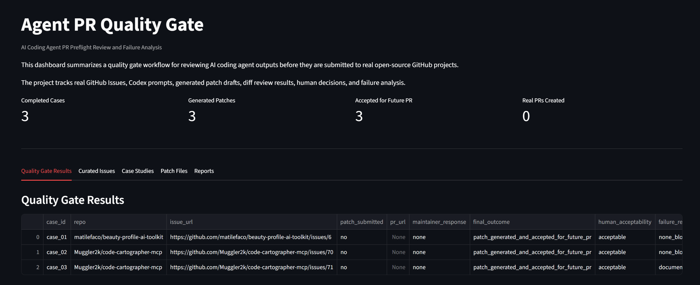

# Agent PR Quality Gate

AI Coding Agent PR Preflight Review and Failure Analysis

## Overview

This project builds a small, auditable workflow for reviewing AI coding agent outputs before they are submitted to real open-source GitHub projects.

The goal is not to let AI automatically create pull requests.

The goal is to evaluate whether AI-generated patches are safe, scoped, accurate, reviewable, and acceptable for future pull request preparation.

## Why This Project Exists

AI coding agents can analyze GitHub Issues and generate patch drafts, but real engineering teams still need quality gates before AI-generated changes enter a codebase.

This project focuses on the preflight review process:

1. Is the Issue suitable for an AI coding agent?
2. Does the generated patch change the correct files?
3. Is the patch the smallest safe change?
4. Does it preserve repository-specific rules?
5. Does it avoid private data and unsupported claims?
6. Are validation steps clear?
7. Is the patch acceptable for future PR preparation?

## Current Project Status

The current version includes:

1. Real GitHub Issue dataset.
2. Three completed case studies.
3. Three generated patch files.
4. Codex prompt logs.
5. Codex result logs.
6. Failure analysis report.
7. Evaluation report.
8. Interview summary.
9. Quality gate result table.

No pull request has been created yet.

## Current Case Studies

| Case    | Repository                           | Issue Type                            | Patch File              | Result                             |
| ------- | ------------------------------------ | ------------------------------------- | ----------------------- | ---------------------------------- |
| Case 01 | matilefaco/beauty-profile-ai-toolkit | AI coding agent safety documentation  | `patches/case_01.patch` | Accepted for future PR preparation |
| Case 02 | Muggler2k/code-cartographer-mcp      | Agent-readable setup documentation    | `patches/case_02.patch` | Accepted for future PR preparation |
| Case 03 | Muggler2k/code-cartographer-mcp      | Agent-readable capabilities reference | `patches/case_03.patch` | Accepted for future PR preparation |

## Workflow

For each case, the workflow is:

1. Select a real GitHub Issue.
2. Analyze whether the Issue is suitable for an AI coding agent.
3. Ask Codex for issue understanding.
4. Record the Codex prompt.
5. Record the Codex output.
6. Ask Codex to generate a minimal patch.
7. Save the generated patch.
8. Ask Codex to review the diff.
9. Record the review result.
10. Make a human review decision.
11. Record failure or learning notes.
12. Decide whether the patch is acceptable for future PR preparation.

## Repository Structure

```text
agent-pr-quality-gate/
  cases/
    case_01_doc_fix.md
    case_02_install_config.md
    case_03_example_fix.md
    case_04_bug_repro.md
    case_05_agent_failure.md

  codex_runs/
    prompts.md
    results.md

  data/
    curated_issues.csv
    quality_gate_results.csv

  patches/
    case_01.patch
    case_02.patch
    case_03.patch

  reports/
    contribution_log.md
    evaluation_report.md
    failure_analysis.md
    interview_summary.md

  app.py
  diff_analyzer.py
  evaluator.py
  issue_classifier.py
  pr_quality_gate.py
  requirements.txt
```

## Key Outputs

### Case Files

The `cases/` directory records the full review process for each GitHub Issue, including:

1. Issue link.
2. Repository.
3. Issue summary.
4. Selection reason.
5. Codex prompt.
6. Codex output summary.
7. Files changed.
8. Diff risk analysis.
9. Validation steps.
10. Human review decision.
11. Final outcome.
12. Failure or learning notes.

### Patch Files

The `patches/` directory stores generated patch drafts.

These patches are not automatically applied to the target repositories.

They are saved as reviewable evidence for future PR preparation.

### Codex Run Logs

The `codex_runs/` directory stores:

1. Prompts sent to Codex.
2. Codex outputs.
3. Human review decisions.
4. Patch generation records.
5. Diff review records.

### Reports

The `reports/` directory contains:

1. `failure_analysis.md`
2. `evaluation_report.md`
3. `interview_summary.md`
4. `contribution_log.md`

These reports summarize risks, evaluation results, and interview-ready project explanation.

## Quality Gate Criteria

Each generated patch is reviewed using the following criteria:

1. Issue clarity.
2. Repository context understanding.
3. Patch scope control.
4. File target correctness.
5. Documentation accuracy.
6. Safety and privacy risk.
7. Repository-specific contract preservation.
8. Diff review result.
9. Manual validation readiness.
10. PR readiness.

## Current Findings

The first three cases show that AI coding agents can generate useful documentation-only patch drafts.

However, documentation-only changes are not risk-free.

Observed risks include:

1. Scope creep.
2. Documentation drift.
3. Incorrect setup instructions.
4. Misstated tool capabilities.
5. Weakening repository-specific contracts.
6. Private information or safety wording risks.
7. Missing validation steps.

## Current Conclusion

Codex can produce useful open-source contribution drafts, but it should not be treated as an automatic PR creator.

A safer workflow is:

1. Analyze the Issue first.
2. Generate the smallest safe patch.
3. Review the diff.
4. Record risks and validation steps.
5. Make a human decision.
6. Only then consider a real PR or Issue comment.

## Next Steps

Planned improvements:

1. Add more curated GitHub Issues.
2. Complete 5 deep case studies.
3. Attempt at least one real Issue comment or pull request.
4. Record maintainer feedback if available.
5. Improve the quality gate checklist.
6. Improve the Streamlit dashboard.
7. Expand the failure taxonomy.
8. Add scoring fields to `quality_gate_results.csv`.

## Evidence Index

This repository is organized as an auditable project portfolio.

Key evidence files:

1. `data/curated_issues.csv`
   Curated real GitHub Issues selected for AI coding agent contribution analysis.

2. `data/quality_gate_results.csv`
   Structured quality gate results for completed cases.

3. `cases/case_01_doc_fix.md`
   Case study for AI coding agent safety documentation.

4. `cases/case_02_install_config.md`
   Case study for agent-readable setup documentation.

5. `cases/case_03_example_fix.md`
   Case study for agent-readable capabilities documentation.

6. `patches/case_01.patch`
   Generated patch draft for Case 01.

7. `patches/case_02.patch`
   Generated patch draft for Case 02.

8. `patches/case_03.patch`
   Generated patch draft for Case 03.

9. `codex_runs/prompts.md`
   Prompt log showing how Codex was used for issue analysis, patch generation, and diff review.

10. `codex_runs/results.md`
    Codex output and human review records.

11. `reports/failure_analysis.md`
    Failure taxonomy for AI coding agent generated contributions.

12. `reports/evaluation_report.md`
    Evaluation report for the first project version.

13. `reports/interview_summary.md`
    Interview-oriented summary of the project.

14. `screenshots/dashboard.png`
    Local Streamlit dashboard preview.

## Resume Summary

Built an AI coding agent PR preflight review workflow based on real GitHub Issues. Used Codex to analyze Issues, generate patch drafts, review diffs, and record human quality gate decisions. Completed documented cases covering AI agent safety documentation, agent-readable setup docs, and agent-readable capabilities references. Produced patch files, prompt logs, result logs, failure analysis, and evaluation reports to assess scope control, documentation accuracy, repository contract preservation, and PR readiness.
## Dashboard Preview



The dashboard shows completed case studies, generated patch files, accepted future pull request candidates, and quality gate results.

## Run the Dashboard Locally

This project includes a Streamlit dashboard for viewing curated GitHub Issues, quality gate results, case studies, generated patch files, and project reports.

Install dependencies:

```bash
pip install -r requirements.txt
```

Run the dashboard:

```bash
streamlit run app.py
```

If the command above does not work, use:

```bash
python -m streamlit run app.py
```

The dashboard will open locally at:

```text
http://localhost:8501
```

Current dashboard views include:

1. Quality Gate Results
2. Curated Issues
3. Case Studies
4. Patch Files
5. Reports

